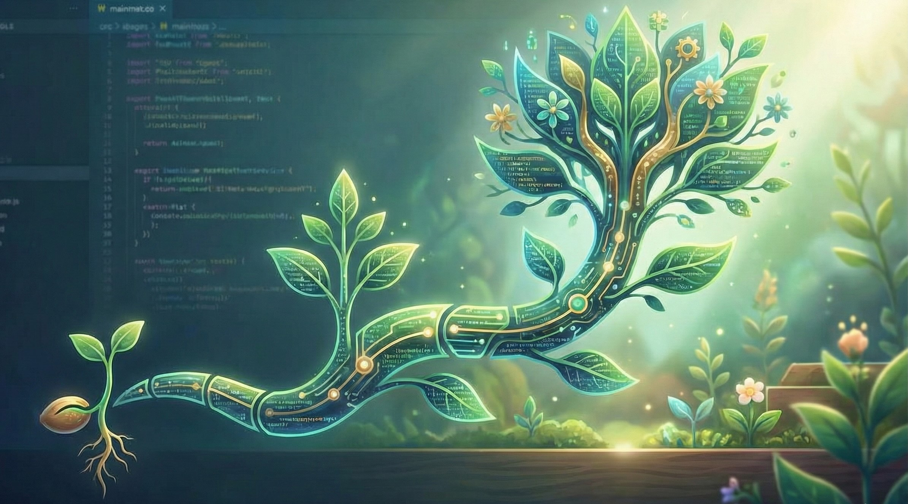

# 🌱 Organic Growth

[](https://github.com/lab71tech/organic-growth/actions/workflows/test.yml) [](https://github.com/lab71tech/organic-growth/releases)

Claude Code setup for incremental software development.

Grow features in natural stages, where each stage delivers a complete, working system.

Inspired by Alistair Cockburn’s Elephant Carpaccio and the idea that projects grow like plants, rather than being sliced from a finished whole.

<p>
  
</p>

## Install

```bash
# In your project directory:
bunx organic-growth

# Or with npx:
npx organic-growth

# With a product DNA document:
bunx organic-growth docs/my-product-spec.md

# Force overwrite existing files:
bunx organic-growth --force

# Upgrade managed files (preserves CLAUDE.md, .mcp.json, etc.):
bunx organic-growth --upgrade
```

This installs `CLAUDE.md` at your project root and a `.claude/` directory with agents and commands. No runtime dependencies.

## What You Get

```
CLAUDE.md                           # Project context template + growth philosophy
.claude/
├── agents/
│   └── gardener.md                 # Plans, implements, and validates growth stages
├── commands/
│   ├── seed.md                     # /seed     — bootstrap new project
│   ├── grow.md                     # /grow     — plan a new feature
│   ├── map.md                      # /map      — view or adjust growth map
│   ├── next.md                     # /next     — implement next stage
│   ├── next-automatic.md           # /next-automatic — run multiple stages automatically
│   ├── replan.md                   # /replan   — adjust when things change
│   └── review.md                   # /review   — deep quality review
├── hooks/
│   ├── post-stage-test.sh          # Automatic test run after stage commits
│   └── post-stage-review.sh        # Automatic diff review after stage commits
└── settings.json                   # Claude Code hook configuration
.organic-growth/
├── product-dna.md                  # Full product DNA (structured)
├── growth-map.md                   # System-level capability map (optional)
└── growth/                         # One growth plan per feature
```

Growth plan files (`.organic-growth/growth/*.md`) use plant-themed visual markers -- seedlings for pending stages, trees for completed ones, vines between sections -- so you can tell at a glance where a feature stands.

A **post-stage test** hook and a **post-stage review** hook run automatically after every stage commit, in order:

1. **Test hook** — runs your test suite (discovered from the `**Test:**` field in CLAUDE.md) and injects pass/fail results into the conversation. On failure, tells Claude to fix before continuing.
2. **Review hook** — captures the commit diff and injects it as review context, giving the gardener agent an immediate second look at what changed.

Tests run first so failures are caught before the review. This makes the quality gate deterministic — tests always run after stage commits, regardless of whether the agent remembers to.

## Workflow

```bash
# 1. Bootstrap (new project)
> /seed                          # interview mode
> /seed .organic-growth/product-dna.md  # from existing product document

# 2. Grow features
> /grow Add user authentication
> /map                           # check/update system-level growth sequence
> /next                          # stage 1
> /next                          # stage 2
> /next                          # stage 3
> /clear                         # fresh session every 3 stages
> /next-automatic 5              # or run multiple stages unattended
> /review 3                      # quality check
> /next                          # continue

# 3. When reality changes
> /replan We need to support SSO instead of basic auth
```

## Philosophy

- **One stage = one intent = one commit**
- **Rolling plan:** 3-5 stages ahead, re-evaluate every 3
- **Two-layer quality:** [properties](#property-based-planning) before code, deterministic tools after every stage, LLM review on demand
- **Context hygiene:** fresh session every 3 stages
- **Product context required:** fill in CLAUDE.md or provide a DNA document

## Property-Based Planning

Each growth stage defines **properties** — rules that must be true about the system — before any code is written.

Properties are not test cases or user stories. A test says "when I do X, Y happens." A property says "this rule always holds."

```
❌ Bad (scenario):  "When I click delete, the item is removed from the list"
✅ Good (property): "Deleting an item persists to storage and the item
                     count decreases by exactly one" [invariant]
```

**Why this matters for LLM-assisted development:** When Claude generates a stage, you review 3-5 properties instead of a 300-line diff. If the properties are right, the code is constrained to be right. The review shifts from "is this code correct?" to "are these rules complete?"

Properties **accumulate** across stages. Stage 3 must still satisfy the properties from stages 1 and 2. They are permanent commitments, not checkboxes to discard. This is what prevents regressions as the feature grows.

The gardener agent handles the full property format — categories, failure analysis, dependency tracking. See the [example growth plan](.organic-growth/example-growth-plan.md) for what this looks like in practice.

## After Install

1. Edit `CLAUDE.md` — fill in the Product section (or run `/seed`)
2. Fill in Quality Tools section with your project's lint/test commands
3. Start building with `/grow`

See the [example growth plan](.organic-growth/example-growth-plan.md) to see properties, stages, and accumulation in action.

## Releases

Releases are triggered manually via the [Release](.github/workflows/release.yml) workflow. When triggered, it:

1. Checks for meaningful commits since the last `v*` tag
2. Bumps the version in `package.json`
3. Commits the version bump and pushes a new `v*` tag
4. Creates a GitHub Release with auto-generated release notes

The [Publish to npm](.github/workflows/publish.yml) workflow triggers on any `v*` tag push and publishes to npm automatically. The full pipeline is: **manual trigger -> version bump -> tag -> GitHub Release -> npm publish**.

```bash
# Patch release (default — bug fixes, small changes)
gh workflow run Release

# Minor release (new features, backwards-compatible)
gh workflow run Release -f bump=minor

# Major release (breaking changes)
gh workflow run Release -f bump=major

# Dry run — preview what would be released without making changes
gh workflow run Release -f dry-run=true
```

Or use the "Run workflow" button on the Actions tab in GitHub.

| Input | Type | Default | Description |
|-------|------|---------|-------------|
| `bump` | choice: `patch`, `minor`, `major` | `patch` | Version bump type |
| `dry-run` | boolean | `false` | When `true`, calculates the version and shows a summary but skips the commit, tag, and release |

## License

MIT
